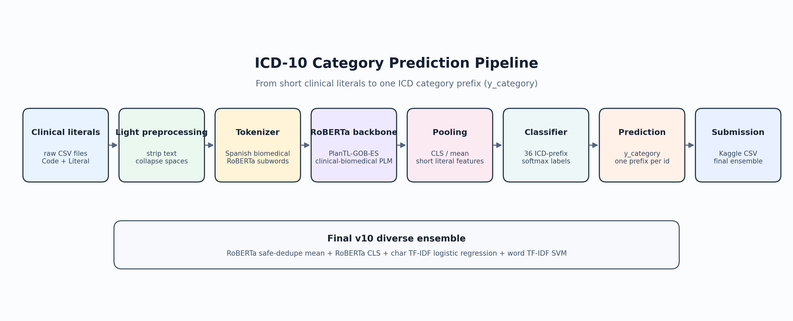

# UAB-ASHO AI Codification

## Clinical Literals To ICD-10 Category Prefixes

ICD coding sits quietly behind hospital statistics, reimbursement, diagnosis
groups, audits, and medical-record management. It is also difficult work:
clinical text is short, compressed, full of abbreviations, and often written
under time pressure. A single literal can carry administrative and clinical
weight, but assigning the right ICD category manually is slow and error-prone.

This project asks a practical NLP question: **can we automatically predict the
ICD-10 category prefix for a short clinical literal?** We approach the task as
students progressively building understanding: first the data and annotations,
then preprocessing, classical baselines, biomedical RoBERTa models, error
analysis, ensembles, and finally a reproducible Kaggle submission.

## Project Identity

**Team 10 - Fundamentals of Natural Language / NLP-I**

| Role | Name | Student ID |
|---|---|---:|
| Student | Phoebe Iglesias | 1713459 |
| Student | David Redrejo | 1790336 |
| Student | Pau Rossell | 1750424 |

**University:** Universitat Autonoma de Barcelona  
**Academic year:** 2025-2026  
**Supervisors/professors:** Ernest Valveny and Lei Kang

## Competition

**Kaggle competition:** UAB-ASHO AI Codification  
**Slug:** `uab-asho-ai-codification`  
**Link:** <https://www.kaggle.com/competitions/uab-asho-ai-codification>

Kaggle provides public leaderboard feedback during development and private
leaderboard scoring for the final competition result. This repository records
validated local metrics and verified public leaderboard scores separately.

**Best verified public score in repository files:** `0.587` with
`v10_vote_diverse_no_retrieval_kaggle.csv`.

**Private/final ranking:** not verified in the repository. Add evidence before
making a final ranking claim:

```text
reports/tables/kaggle_submission_scores.csv
reports/figures/kaggle_final_ranking.png
```

## What The Model Does

Given a short clinical literal:

```text
Hiperparatiroidismo primario
```

the system predicts one ICD category prefix:

```text
y_category = E
```

The label is derived as the first character of the ICD code:

```python
y_category = Code.astype(str).str[0]
```

The task is **single-label multiclass classification** over the expected 36
categories: digits `0`-`9` and letters `A`-`Z`.

## Final Architecture



The final public candidate is a deliberately diverse ensemble:

- `v08_safe_dedupe`: RoBERTa mean pooling with safe duplicate handling.
- `v04_roberta_cls`: RoBERTa CLS pooling.
- `v01_tfidf_char_logreg`: character TF-IDF with logistic regression.
- `v02_word_tfidf_svm`: word TF-IDF with a linear SVM.

This combination gives the final model both contextual biomedical language
representations and robust surface-form signals from classical Machine Learning.

## Repository Structure

```text
.
├── data/                  # raw, interim, and processed competition data
├── notebooks/             # narrative notebooks from EDA to final submission
├── src/                   # reusable loading, preprocessing, training, evaluation
├── models/                # runnable versioned model scripts
├── configs/               # experiment plans and model registry
├── outputs/               # metrics, predictions, logs, checkpoints
├── submissions/           # Kaggle-ready CSV files
├── reports/               # final report, figures, tables, references
├── presentations/         # short and final presentation material
└── tests/                 # smoke tests and correctness checks
```

## Main Results

Validation metrics use the shared internal split. Public scores are included
only when a verified Kaggle submission exists.

| Version | Model | Validation accuracy | Macro F1 | Weighted F1 | Kaggle public |
|---|---|---:|---:|---:|---:|
| `v00` | Majority baseline | 0.125182 | 0.006181 | 0.027854 | - |
| `v01` | Character TF-IDF + logistic regression | 0.522628 | 0.402554 | 0.494943 | 0.550 |
| `v02` | Word TF-IDF + linear SVM | 0.520073 | 0.474196 | 0.514018 | 0.536 |
| `v03` | Similarity / retrieval baseline | 0.497445 | 0.462789 | 0.496120 | - |
| `v04` | RoBERTa CLS pooling | 0.569343 | 0.494329 | 0.554347 | 0.573 |
| `v05` | RoBERTa mean pooling | 0.564599 | 0.496567 | 0.549541 | 0.556 |
| `v06` | Imbalance-aware RoBERTa | 0.557299 | 0.480394 | 0.539776 | 0.555 |
| `v07` | Tuned RoBERTa mean pooling | 0.564599 | 0.494151 | 0.549054 | 0.572 |
| `v08` | Safe data-strategy RoBERTa | 0.568613 | 0.481648 | 0.549150 | 0.583 |
| `v09` | Validation-selected ensemble | 0.576642 | **0.506277** | **0.561544** | 0.573 |
| `v10` | Diverse ML ensemble | **0.579562** | 0.496677 | 0.561294 | **0.587** |

Final files:

```text
submissions/final_submission.csv
outputs/predictions/final_leaderboard_detailed.csv
FINAL_MODEL_CARD.md
SUBMISSION.md
```

## Model Evolution

We did not jump directly to the final model. Each version answers a specific
question from the data, the course, or the ICD-coding survey.

| Version | Question |
|---|---|
| `v00` | How much does class imbalance explain by itself? |
| `v01` | Can character n-grams capture abbreviations, digits, morphology, and fragments? |
| `v02` | Is there enough word-level lexical signal for TF-IDF? |
| `v03` | What happens if coding is treated as nearest-neighbor retrieval? |
| `v04` | How strong is a Spanish biomedical RoBERTa CLS baseline? |
| `v05` | Does mean pooling help short clinical literals? |
| `v06` | Can class weighting or focal loss help the long tail? |
| `v07` | Which training hyperparameters matter most? |
| `v08` | Can safe duplicate handling improve generalization without unsafe augmentation? |
| `v09` | Do complementary RoBERTa and TF-IDF models improve validation metrics? |
| `v10` | Can a more diverse ML ensemble improve the verified public score? |

## How To Reproduce

Create the environment:

```bash
python -m venv .venv
source .venv/bin/activate
pip install -r requirements.txt
```

Place the competition files in:

```text
data/raw/codification_data.csv
data/raw/leaderboard_data.csv
data/raw/icd_d_p_pairs.csv
```

Run the project phases:

```bash
# 1. Data inventory and schema validation
python -m src.data_loading

# 2. Required light preprocessing
python -m src.preprocessing

# 3. Tokenization analysis
python scripts/analyze_tokenization.py

# 4. Classical baselines
python models/v00_majority_baseline.py
python models/v01_tfidf_char_logreg.py
python models/v02_tfidf_word_svm.py
python models/v03_similarity_retrieval_baseline.py

# 5. RoBERTa baselines and improvements
python models/v04_roberta_cls.py
python models/v05_roberta_mean.py
python models/v06_roberta_mean_imbalance_aware.py
python models/v07_roberta_mean_tuning.py
python models/v08_roberta_mean_augmented.py

# 6. Ensembles, evaluation, and final artifacts
python models/v09_ensemble.py
python models/v10_diverse_ensemble_search.py
python -m src.evaluation
```

Submit to Kaggle:

```bash
kaggle competitions submit \
  -c uab-asho-ai-codification \
  -f submissions/final_submission.csv \
  -m "Team 10 final public-best v10 diverse ensemble"
```

Full reproducibility notes are in [`REPRODUCIBILITY.md`](REPRODUCIBILITY.md).

## Notebooks

| Notebook | Purpose |
|---|---|
| `00_task_formulation_and_eda.ipynb` | Data, annotations, distributions, duplicates, and risks |
| `01_data_preprocessing_and_annotation_design.ipynb` | Preprocessing and tokenizer-length decisions |
| `02_reference_methods_from_survey.ipynb` | Mapping ICD-coding research to our assignment |
| `03_classical_baselines.ipynb` | Majority, TF-IDF, and retrieval baselines |
| `04_roberta_backbone_baseline.ipynb` | RoBERTa CLS and mean-pooling baselines |
| `05_advanced_model_experiments.ipynb` | Structured improvement roadmap |
| `06_hyperparameter_and_ablation_studies.ipynb` | Tuning and safe data-strategy experiments |
| `07_evaluation_error_analysis_and_interpretability.ipynb` | Model comparison, confusion, confidence, and errors |
| `08_submission_and_final_story.ipynb` | Final model declaration and Kaggle submission story |

## Reports And Presentations

- Final LaTeX report: [`reports/final_report.tex`](reports/final_report.tex)
- References: [`reports/references.bib`](reports/references.bib)
- Figures: [`reports/figures/`](reports/figures/)
- Tables: [`reports/tables/`](reports/tables/)
- Short presentation: [`presentations/short_presentation/`](presentations/short_presentation/)
- Final presentation: [`presentations/final_presentation/`](presentations/final_presentation/)
- Final model card: [`FINAL_MODEL_CARD.md`](FINAL_MODEL_CARD.md)
- Submission notes: [`SUBMISSION.md`](SUBMISSION.md)

## Ethical And Clinical Caution

This is an academic NLP competition project, not a clinical device and not a
production coding assistant. It predicts broad ICD category prefixes from short
literals, not full ICD codes from complete medical records.

The system can make mistakes on ambiguous literals, abbreviations, rare
categories, and cases that require clinical context. Any real healthcare use
would require expert validation, governance, privacy review, monitoring,
accountability, and integration with professional coders rather than replacing
them.

## Acknowledgements And References

We thank Ernest Valveny and Lei Kang for supervising the project in the
Fundamentals of Natural Language / NLP-I course at UAB.

This work builds on:

- the Kaggle competition **UAB-ASHO AI Codification**;
- Yan et al. (2022), survey on automated ICD coding methods and challenges;
- the Hugging Face model
  [`PlanTL-GOB-ES/roberta-base-biomedical-clinical-es`](https://huggingface.co/PlanTL-GOB-ES/roberta-base-biomedical-clinical-es);
- course material on corpora, basic text processing, vector-space models,
  Transformers, evaluation, and responsible use of NLP.
