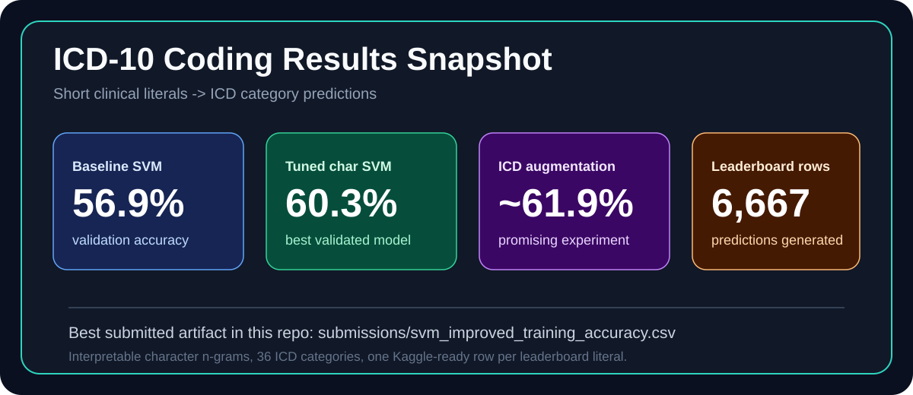
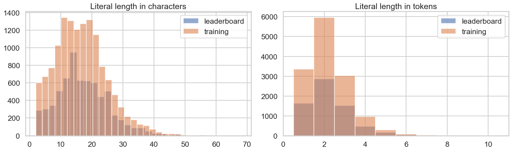
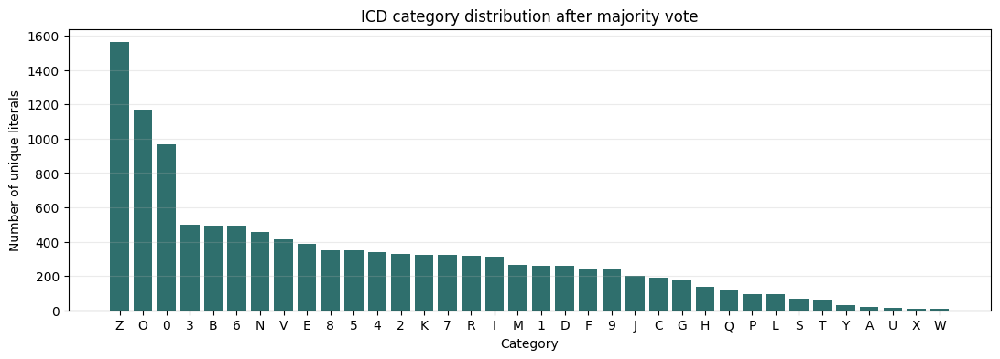
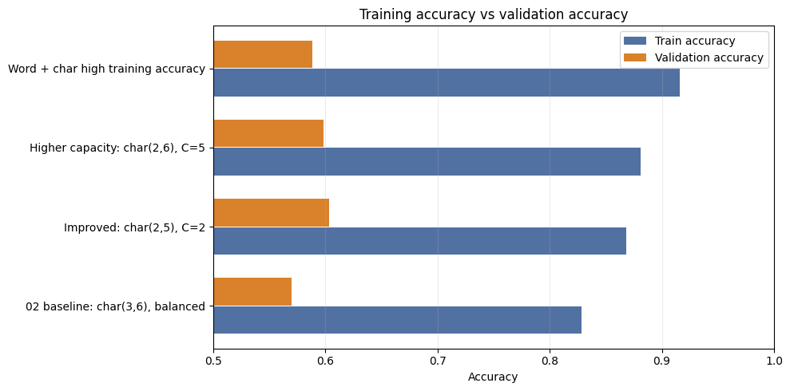
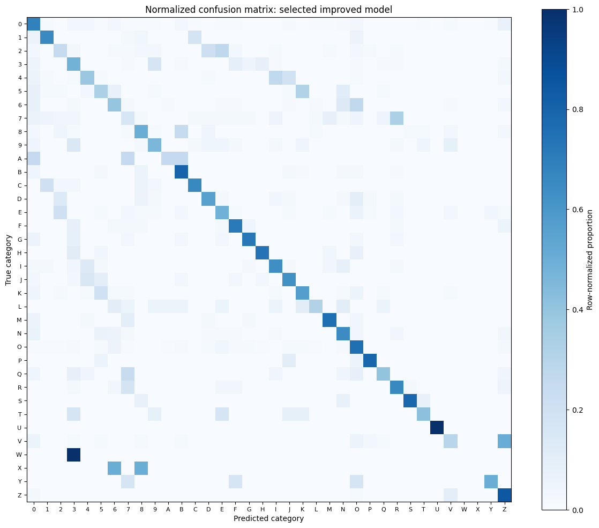

# ICD-10 Code Prediction from Short Clinical Literals

<p align="center">
  <strong>Fundamentals of Natural Language Processing · Universitat Autonoma de Barcelona · 2025-2026</strong><br/>
  Group 10 · Phoebe Iglesias · David Redrejo · Pau Rossell
</p>

<p align="center">
  
  
  
  
</p>

---

## The hook

Most ICD coding projects imagine long clinical notes. This one is sharper and stranger:

> Given a tiny clinical literal such as `HTA irc 6`, `VHC`, or `breast prosthesis`, predict the first character of its ICD code.

That means the model has almost no context to hide behind. It must learn from fragments, abbreviations, spelling variants, accents, numbers, and the quiet structure of the ICD code system itself.

The final target is:

```math
y_{category} = first(Code)
```

The best validated model in this repository is not the largest one. It is the model that understood the shape of the data best:

```text
normalized literal
  -> character n-grams
  -> TF-IDF weighting
  -> Linear SVM
  -> ICD category
  -> Kaggle-ready submission
```

<p align="center">
  
</p>

---

## Kaggle standing

This repository contains the Kaggle-ready prediction files, but it does **not** currently contain an official Kaggle leaderboard screenshot, public score, or rank export. I therefore do not fabricate a position.

| Kaggle item | Current repository evidence |
|---|---|
| Recommended submission | `submissions/svm_improved_training_accuracy.csv` |
| Rows predicted | `6,667` leaderboard literals |
| Output columns | `id`, `Literal`, `y_category` |
| Categories covered | `36` ICD categories |
| Official Kaggle rank | Not stored in this repository snapshot |
| Official Kaggle score | Not stored in this repository snapshot |

When the official leaderboard position is available, update this block:

```text
Kaggle team:
Public score:
Private score:
Leaderboard rank:
Snapshot date:
```

The model we would submit first is:

```text
submissions/svm_improved_training_accuracy.csv
```

---

## Results at a glance

| Stage | Model / experiment | Train accuracy | Validation accuracy | What it taught us |
|---|---:|---:|---:|---|
| Baseline | Char TF-IDF `(3,6)` + LinearSVC, balanced weights | `0.8286` | `0.5701` | Strong first lexical baseline, but too cautious for short literals |
| Improved | Char TF-IDF `(2,5)` + LinearSVC, `C=2`, no class weights | `0.8680` | `0.6034` | Best validated model: higher train and validation performance |
| Higher capacity | Char TF-IDF `(2,6)` + LinearSVC, `C=5` | `0.8814` | `0.5982` | More capacity, slightly worse generalization |
| Word + char | FeatureUnion word/char TF-IDF + LinearSVC | `0.9162` | `0.5883` | Memorizes harder, generalizes worse |
| ICD descriptions | Optional augmentation with official ICD descriptions | lower on original literals | `~0.619` | Promising, but needs cross-validation before being the official model |

The central result is a simple one:

```text
The best model is not the one that memorizes most.
It is the one that improves validation while staying interpretable.
```

---

## Visual evidence

The strongest evidence is visual. The project is built around checking assumptions before trusting a model.

### The data is short

<p align="center">
  
</p>

Clinical literals are extremely short compared with official ICD descriptions. That is why character fragments matter.

### The labels are imbalanced

<p align="center">
  
</p>

Some categories are common, while others are almost invisible. This explains why exact accuracy, macro-F1, and class weighting do not always move in the same direction.

### The improved SVM generalizes best

<p align="center">
  
</p>

The word+character model reaches higher training accuracy, but validation drops. The tuned character model is the better submission candidate.

### The confusion matrix shows where the task is hard

<p align="center">
  
</p>

The diagonal is the story we want. The off-diagonal blocks are where short literals, numeric procedure families, and ambiguous clinical phrasing still collide.

---

## What we actually built

This project is an end-to-end ICD category prediction pipeline:

1. **Data understanding**
   - identifies the role of each CSV,
   - studies literal length and surface patterns,
   - measures overlap between training, leaderboard, and ICD catalog,
   - detects ambiguity and synonymy.

2. **Classical baseline**
   - normalizes text,
   - extracts character TF-IDF features,
   - trains a linear SVM,
   - evaluates strict accuracy, weighted-F1, macro-F1, precision, and recall.

3. **Improved classical model**
   - preserves rare n-grams with `min_df=1`,
   - captures shorter fragments with `(2,5)` character n-grams,
   - removes balanced weights when strict accuracy is the target,
   - validates the final submission format.

4. **GPU-ready deep learning baseline**
   - prepares a Spanish biomedical RoBERTa classifier,
   - uses mean pooling over token embeddings,
   - supports CUDA, mixed precision, early stopping, and checkpointing.

---

## Repository map

```text
notebooks/
  01_eda.ipynb
  02_baseline_models.ipynb
  03_improved_training_accuracy.ipynb
  04_dl_baseline_roberta.ipynb

src/
  data_processing.py
  evaluation.py

submissions/
  svm_baseline.csv
  svm_improved_training_accuracy.csv

Report/
  Report.pdf
  Report.tex
  eda_*.png
  improved_*.png

docs/
  info/
  plots/
```

Raw datasets are intentionally not committed. Place them under `data/`.

Expected local files:

```text
data/codification_data.csv
data/leaderboard_data.csv
data/icd_d_p_pairs.csv
```

---

## Recommended reading path

| Notebook | Main question | Why it matters |
|---|---|---|
| `01_eda.ipynb` | What kind of problem is this really? | Shows that this is short-literal coding, not long-document ICD coding |
| `02_baseline_models.ipynb` | How strong is a clean classical baseline? | Builds the first TF-IDF + SVM pipeline and submission |
| `03_improved_training_accuracy.ipynb` | Which baseline choices actually help? | Tunes n-grams, class weights, feature filtering, and capacity |
| `04_dl_baseline_roberta.ipynb` | Can a GPU transformer beat the lexical model? | Prepares the RoBERTa experiment for CUDA execution |

The notebooks are written as project chapters. They explain the decision, run the code, read the result, and then move to the next step.

---

## Installation

Recommended Python version: **Python 3.10+**.

### Windows

```bash
python -m venv .venv
.venv\Scripts\activate
pip install -r requirements.txt
```

### Linux / macOS

```bash
python -m venv .venv
source .venv/bin/activate
pip install -r requirements.txt
```

### Start Jupyter

```bash
jupyter lab
```

Then open the notebooks in order.

---

## Reproducing the classical submission

1. Put the three CSV files in `data/`.
2. Run:

```text
notebooks/01_eda.ipynb
notebooks/02_baseline_models.ipynb
notebooks/03_improved_training_accuracy.ipynb
```

3. The recommended submission is written to:

```text
submissions/svm_improved_training_accuracy.csv
```

The submission is validated inside the notebooks:

```text
columns: id, Literal, y_category
rows: same as leaderboard_data.csv
empty predictions: none
```

---

## GPU path: RoBERTa

Notebook `04_dl_baseline_roberta.ipynb` is designed for a GPU runtime.

It uses:

```text
PlanTL-GOB-ES/roberta-base-biomedical-clinical-es
```

The model architecture is:

```text
literal
  -> RoBERTa tokenizer
  -> biomedical RoBERTa encoder
  -> mean pooling over non-padding tokens
  -> dropout
  -> linear classifier
  -> ICD category
```

On CUDA, the notebook enables mixed precision automatically. On CPU, it can run, but training will be slow.

---

## What makes the final model interpretable?

The tuned SVM is not a black box. Its features are character n-grams, so we can inspect which fragments push a prediction toward each ICD category.

Examples of the kind of evidence we expect:

```text
respiratory category -> asthma / bronchial fragments
circulatory category -> hta / cardio fragments
pregnancy category   -> delivery / pregnancy fragments
status category      -> blood group / follow-up fragments
renal category       -> renal / kidney failure fragments
```

This is the main advantage of the classical model: it is fast, strong, and explainable enough to defend.

---

## Key takeaways

- **Short text changes everything.** Two-token literals reward character fragments more than large context windows.
- **Normalization is not cosmetic.** It increases useful overlap between train and leaderboard literals.
- **The ICD catalog is helpful but not a lookup table.** Official descriptions are often lexically far from clinical literals.
- **Strict accuracy and class fairness pull in different directions.** Balanced weights are not automatically better.
- **The best validated model is the tuned character SVM.** It reaches `0.6034` validation accuracy and generates a complete leaderboard submission.
- **RoBERTa is the GPU experiment, not the baseline.** It is ready for fine-tuning, but the classical model is already a strong target to beat.

---

## Credits

Project developed for **Fundamentals of Natural Language Processing**, Universitat Autonoma de Barcelona, 2025-2026.

Team:

```text
Phoebe Iglesias
David Redrejo
Pau Rossell
```

---

<p align="center">
  <strong>From tiny clinical literals to ICD categories.</strong><br/>
  Interpretable NLP first. GPU models only when they have something real to prove.
</p>
